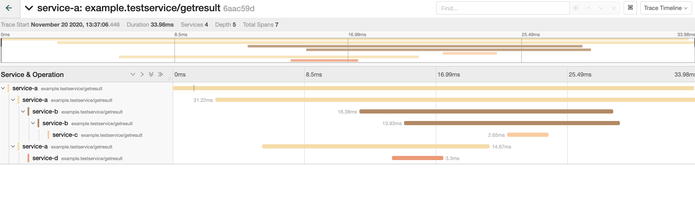
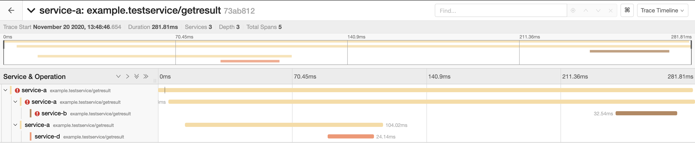
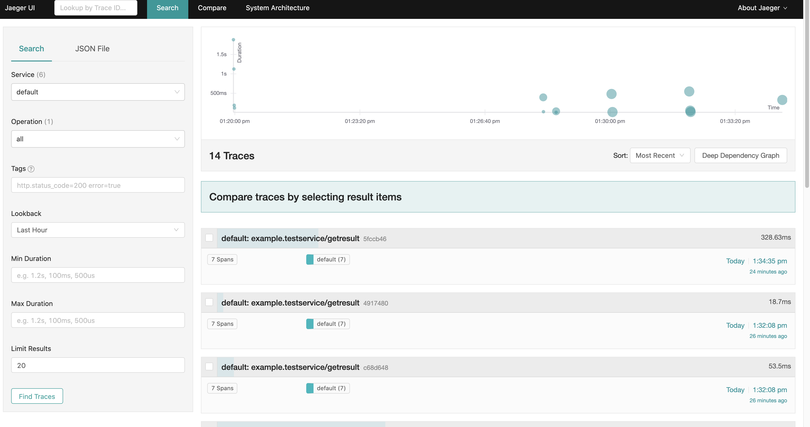

# spring-cloud-sleuth-with-grpc

spring cloud sleuth를 spring grpc starter 환경에서 테스트한 Repo입니다.

## Scenario
1. (A)--getResult-->(B)--getResult-->(C)
2. (A)--getResult-->(D)

- A서버가 1, 2의 Reponse를 Zip하여 Client에게 반환

## Result
1. Jaeger Console with successful response


2. Jaeger Console with failed response (error is occurred from service B)


## How to test with jaeger
### jaeger all-in-one installation

```
docker run -d --name jaeger \
>   -e COLLECTOR_ZIPKIN_HTTP_PORT=9411 \
>   -p 5775:5775/udp \
>   -p 6831:6831/udp \
>   -p 6832:6832/udp \
>   -p 5778:5778 \
>   -p 16686:16686 \
>   -p 14268:14268 \
>   -p 14250:14250 \
>   -p 9411:9411 \
>   jaegertracing/all-in-one:1.20
```

### Jaeger Console
`http://localhost:16686/`



